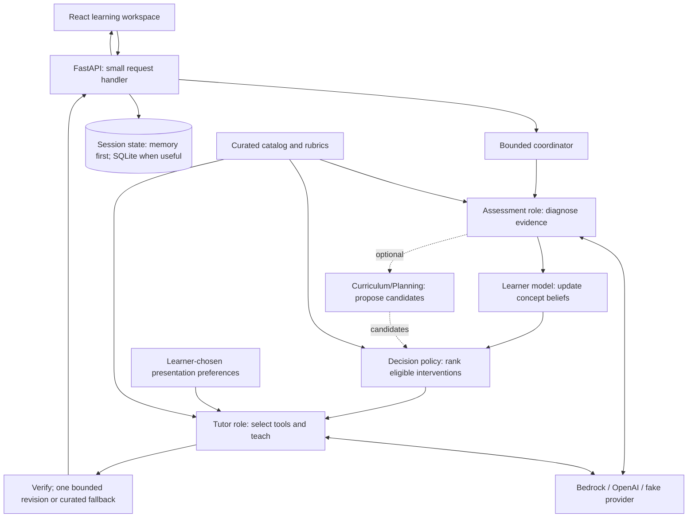

# Architecture proposal

Status: core architecture and G1 were approved. The deterministic G1 implementation is on `codex/baseline` for review; G2 remains unauthorized. G1 scope is defined only by PHASE2.md; the real agents, mathematics and full demo behavior below are post-G1 targets. The brief and brainstorm image describe the product vision, not mandatory components. Hackathon length and exact AWS judging requirements are unknown; sequence work by acceptance gates, not an assumed number of days.

## Product and demo scope

Focus on adult learners studying one small part of Intro AI: graph search and heuristics. Use six concept IDs: `bfs`, `ucs`, `astar`, `admissibility`, `consistency`, `admissibility_vs_consistency`. Display Course → Unit → Topic → Concepts, but update beliefs only at concept level. Topic/course summaries are navigation aids, never evidence-bearing variables.

The MVP has one workspace: question and response, tutor feedback, concept estimates with uncertainty, and a collapsible “Why this next?” panel. Use typed answers and multiple choice, a curated bank of roughly 12–18 questions, three teaching approaches, and repeatable anonymous demo sessions. Every scorable question has exactly one primary concept and a comparable difficulty band; secondary tags are context only.

The visible loop is: answer → diagnose → update a concept estimate → choose a targeted activity → teach → ask a fresh question → observe again. A wrong answer can change both the uncertainty and the teaching approach. Explanations alone do not increase a score.

## Learner Presentation Preferences

`Student knowledge state + learner presentation preferences → teaching response`

Offer just three learner-chosen options: **plain language / explain jargon**, **step-by-step**, and **concise**. They change the wording and organization of the selected teaching response. Step-by-step plus concise means short numbered steps. All are optional; ordinary clear, accessible teaching remains the default.

Pass preferences only to Teaching, alongside the concept estimates and the policy's selected intervention. They are not learning evidence or inputs to Assessment, the learner model, the policy, or Curriculum/Planning. Toggling them never changes mastery, uncertainty, evidence counts, grading, or the selected intervention/question. Later valid answers can still update knowledge normally. A presentation choice is not a hint or an assisted-answer flag by itself.

Do not create a first-generation student mode, infer disability/identity from behavior, or assign demographic labels. Use standard accessible UI practices for everyone: semantic controls and labels, keyboard operation and visible focus, readable contrast, scalable text/browser zoom, and respect for reduced-motion settings. These need no preference subsystem. SWE2 handles the small controls, SWE4 teaching formatting, and SWE1 the existing wiring; no new workstream, service or model.

## One application, a few module boundaries



Arrows show data flow within one Python process, not microservices. The coordinator calls model/policy/teaching interfaces injected at startup. Modules exchange shared typed values, not HTTP requests. SWE1 wires dependencies and owns state access. G1 uses memory unless SQLite is equally quick; persistence is not a baseline requirement. The frontend uses only the public API, never internal Python or model providers.

| Choice | Reason |
| --- | --- |
| React + TypeScript + Vite | Fast interactive UI, visible traces/charts, one frontend toolchain |
| FastAPI + Pydantic + Python | Typed API and one language for agents and the data scientist |
| One Python environment, managed with uv | One dependency resolution point; no per-agent environments |
| In-memory G1; SQLite when useful | Fastest first loop; later simple persistence without a database server |
| Plain Python coordinator and allowlisted tools | Bounded behavior is easier to inspect and test than a new agent framework |
| Bedrock primary, OpenAI alternative, fake default | Meaningful AWS inference with local development independent of credentials |
| Single container on EC2 later | Same application locally and in AWS; simple disk persistence if needed |

Dependency versions are to be pinned together in Phase 2, not guessed or installed in Phase 1. Native development runs the Vite dev server and backend; a built deployment serves static frontend assets from FastAPI on one origin. One server worker and sequential use for G1; no transaction or concurrency protocol is required. If SQLite is added later, keep it to a few straightforward reads/writes. No background queue or streaming protocol in the initial slice.

## Two to three meaningful agentic roles after G1

**Assessment role:** reads the active item's server-side rubric, examines an answer, identifies a misconception or abstains, and proposes approved teaching approach IDs. Multiple-choice correctness is determined by the answer key, not the LLM. For free text, rubric assessment can produce binary evidence only when accepted under the explicit evidence rules. Ambiguity prompts a diagnostic question rather than inventing confidence.

**Tutor role:** receives the selected intervention, concept state summary and explicit presentation preferences. It may request an allowlisted `lookup_concept` or `get_worked_example` tool, choose an explanation suited to the diagnosed misconception, and revise once following verifier feedback. Preferences affect delivery, not the intervention or evidence rules. A validator checks IDs, scope, prerequisites, answer leakage and basic domain facts. Failed content falls back to a reviewed template. The verifier is a function/tool plus author-reviewed fixtures, not another named agent or a claim of proof.

**Optional Curriculum/Planning role:** use the team's agentic engineering strength to propose a short remedial path or approved activity candidates from the reviewed catalog. Add it only when the demo visibly improves—for example, proposing prerequisite review after a diagnosed misconception. It may explain proposals and use bounded catalog tools; it never writes mastery or makes the final intervention choice. SWE3 owns this role, with SWE4 content and DS policy input. Omit it if it merely repeats the existing policy.

The coordinator is ordinary program control: assess, update, optionally propose candidates, select, teach, verify. It is not a third LLM supervisor. The policy may reject the assessor's proposed approach when eligibility, uncertainty or repetition rules favor another. Tutor decisions cannot change the concept selected by the policy. This separation creates meaningful interplay between diagnosis, quantitative state, and tool use.

Allow at most four provider calls per turn across all roles, including retries/revisions, and two local tool invocations. Target a 20-second overall deadline for a live turn; choose per-call timeouts so a curated response fits within it. Typical path: assessment, tutor planning/tool request, tutor answer. The remaining call may support the optional curriculum proposer or a repair; it does not increase the total budget. If repair is needed after the budget is exhausted, use curated fallback. Return typed degraded results on exhaustion. No unbounded loops, tool-created agents, shell/network tools, autonomous browsing, or hidden cloud fallback.

These live-role budgets and detailed traces belong to G2/G3, not G1. G1 only needs four fake calls and a simple stage list. Agent Toolkit for AWS supports the coding agents during AWS development (see AWS.md); it is not a runtime role.

Trace the observable decisions: assessed concept, evidence accepted/skipped, before/after state, candidate scores, chosen action, tool names, verification/fallback, provider and elapsed time. Do not expose chain-of-thought.

## Mathematical MVP

Use a Beta–Bernoulli model for success on comparable, fresh, unaided questions for each concept. This is a tractable performance proxy, not a latent cognitive diagnosis. Start each concept with `Beta(1, 1)`; denote its parameters by `alpha`, `beta`.

For accepted binary evidence `y` (0 or 1):

```text
alpha_next = alpha + y
beta_next  = beta + (1 - y)
mean       = alpha_next / (alpha_next + beta_next)
variance   = alpha_next * beta_next /
             ((alpha_next + beta_next)^2 * (alpha_next + beta_next + 1))
interval90 = [BetaQuantile(0.05), BetaQuantile(0.95)]
```

The conjugate update follows the standard [Beta–Bernoulli derivation](https://web.stanford.edu/class/archive/cs/cs109/cs109.1246/lectures/21_beta.pdf). The interpretation assumes comparable independent observations of a stable success probability. Learning, question difficulty and correlated answers violate that idealization; the prototype makes no calibration or longitudinal mastery claim.

- Update only the primary concept of the active question. Never copy one answer to all concept tags or aggregate syllabus scores.
- Accept one update per unique question per session, only for an unaided `answer`. Retries, requests for hints, copied/revealed solutions, ambiguous grading, and already-scored questions give no update. Score a new transfer question after teaching.
- Use `accepted`, `ambiguous`, or `unscorable` evidence quality; LLM self-reported confidence is not a calibrated probability. MVP has no fractional pseudo-counts or partial credit.
- Retain evidence count, mean and 90% posterior interval. Label low-data states prominently. Conflicting evidence may widen an interval; do not require every answer to increase certainty.
- No automatic forgetting, inferred prerequisite propagation, fitted item difficulty or learned treatment effects. Both DS and SWE4 review the question difficulty/primary-concept mapping.
- UI label: “Mastery estimate — predicted success on similar unaided questions; experimental.” The uncertainty interval is conditional on the model assumptions, not a guarantee of correctness.

DS implements the real equations only after the dummy baseline. Validate analytic examples, skipped/duplicate evidence, prior handling, concept isolation, and replay of a fixed evidence sequence. Compare deterministic policies on synthetic traces only as engineering checks; do not present them as student outcome studies.

## Decision MVP: explicit uncertainty-aware heuristic

Three intervention kinds: `diagnostic_probe`, `worked_example`, `socratic_hint`. Each approved candidate identifies a concept, an authored content item, and a fresh follow-up question. Catalog eligibility supplies difficulty and prerequisite constraints. A listed prerequisite is ready when its mean is at least 0.6 with at least two accepted observations; these thresholds are unvalidated heuristics. If a prerequisite is not ready, exclude that teaching candidate and allow a diagnostic probe of the prerequisite. Diagnostic probes have no prerequisite gate, so unknown state cannot deadlock the session. Introductory demo examples may have empty prerequisite lists when their explanations are self-contained.

For a candidate's concept, let `m = 1 - mean`, `u = interval90.upper - interval90.lower`, and `d = 1` only when an accepted diagnosis matches that concept's authored misconception; otherwise `d = 0`. Initial, deliberately hand-tuned priorities are:

```text
diagnostic_probe: 0.65*u + 0.35*m
worked_example:   0.65*m + 0.35*d
socratic_hint:   0.50*m + 0.30*d + 0.20*u
```

Remove ineligible candidates and already-scored follow-up questions first. Prefer a different intervention than the immediately preceding one when another eligible candidate exists. Select the highest score, breaking ties by candidate ID. For `ask_hint`, restrict candidates to the active concept's Socratic hints and preserve the active question; a subsequent answer is assisted and not scorable. Stop cleanly when no fresh questions remain.

These weights are hypotheses chosen for explainability, not optimized parameters. The UI calls the quantity “selection priority,” never “expected learning gain.” Log score components and reasons; show the top candidates. This allows judges to see how weak performance, uncertainty and diagnosis affect the decision.

Thompson Sampling is a stretch only if time remains after the full live demo. It would need a separate posterior over intervention outcomes and a defined reward based on later unaided transfer performance, with an explicit cold-start policy. Sampling concept mastery alone does not establish intervention efficacy. Do not promise contextual bandits, BKT and IRT in the same MVP.

## What changed from the brainstorm

| Brainstorm component | Decision |
| --- | --- |
| Quiz, chat, flashcards, separate analytics | One learning workspace with integrated concept and decision panels |
| Voice, image uploads | Defer until text adaptation and AWS demo are reliable; one optional image feature later |
| Supervisor and eight specialist agents | Two core agentic roles, optional Curriculum/Planning proposer; bounded coordinator/verifier; quantitative policy selects |
| Digital twin | Small per-concept Bayesian performance model with honest uncertainty |
| Planning/simulation engine | Explainable candidate ranking; no simulated causal learning gains |
| Content/research agent, large question bank | Authored local catalog with sources, rubrics and misconception tags |
| Separate LLM support service | Provider adapter inside backend |
| Auth and session manager | Adopted post-G1: Cognito-backed per-user accounts (Hosted UI, ID-token verification), with the anonymous per-browser session as the fallback when no one is signed in |
| Data store driving the user loop | API-owned memory for G1, simple SQLite later if useful; backend returns the public response directly |

Reject microservices, vector databases/RAG, arbitrary syllabus ingestion, model training, production identity, separate dashboards, queues and elaborate agent frameworks for the initial demo. Each adds coordination work without proving the central learning loop.
